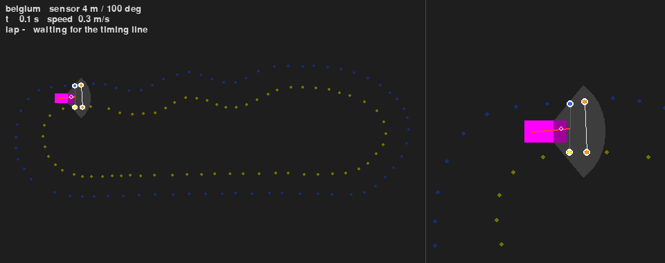
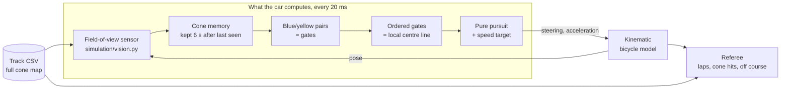
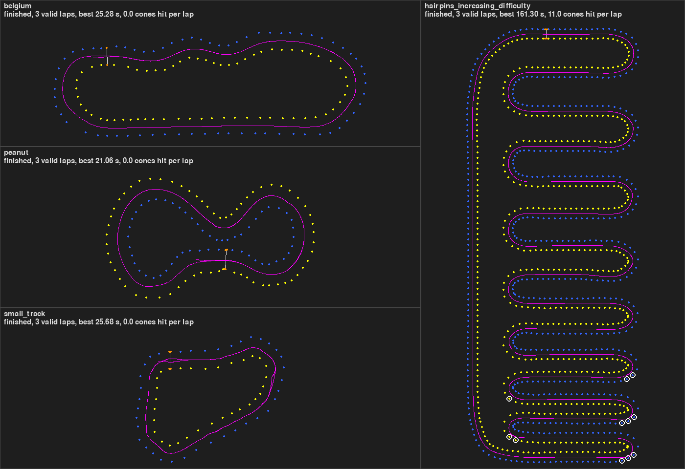

# TLSe Racing Driverless - 2D cone-track simulator



*One lap of `belgium` with the default sensor (4 m range, 100 degree field of view), played at
twice the simulated speed. Left: whole track. Right: follow view. Dimmed cones are unknown to the
car, cones in full colour are in its memory, cones with a white ring are inside the sensor sector
right now. Grey segments are the blue/yellow pairs, the red line is the centre line built from
them. Recorded off-screen by `scripts/record_gif.py`.*

A small 2D simulator for a Formula Student driverless car on cone tracks, written in Python with
Pygame. It was started in November 2025 by two members of the driverless team of TLSe Racing
(Formula Student, 2025-2026 season) to try out driving logic before anything runs on a car. It is
a team prototype hosted on a personal account, not the team's official software.

The repository has two layers, written a year apart:

- **November 2025, team work.** The simulation layer (track loader, camera, viewer, field-of-view
  sensor model) by Guilhem Carmouze, and a first reactive controller by a teammate.
- **October 2026, follow-up by Guilhem Carmouze.** The `closed_loop/` package: a controller that
  completes laps using only what the sensor model lets the car see, a referee that times laps and
  counts cone contacts, a benchmark, tests and CI. It lives in separate modules; the 2025 files are
  unchanged apart from one docstring.

Everything here is a 2D simulation result. Nothing in this repository has run on a real car.

## Status

| Part | Files | Written | State |
|---|---|---|---|
| Track loader (typed, schema check) | `track_utils.py` | Nov 2025, G. Carmouze | Works, tested |
| 2D camera (fit to track, zoom about cursor, pan) | `simulation/camera.py` | Nov 2025, G. Carmouze | Works, tested |
| Field-of-view sensor model (range + opening angle) | `simulation/vision.py` | Nov 2025, G. Carmouze | Works, tested. Purely geometric: no occlusion, no image processing |
| Track viewer (car moved along a given path, sector overlay) | `simulation/main_simulation.py` | Nov 2025, G. Carmouze | Works. Reachable through `scripts/show_track.py`; `main.py` no longer calls it |
| Reactive controller (aim at the midpoint of the nearest visible blue and yellow cones, constant 5 m/s) | `realtime.py`, `main.py` | Nov 2025, a teammate | Opens and runs. First prototype: it uses only the cones in view, keeps no memory of them and has nothing to do when none is in view. Replayed off-screen with `scripts/replay_reactive.py`, the car strays more than 4 m from the middle of the track on all four bundled tracks within 40 simulated seconds |
| Offline "zipper" centre line | `planning.py` | Nov 2025, a teammate | Not called by any entry point |
| Closed loop (cone memory, paired-cone centre line, bicycle model, pure pursuit) | `closed_loop/` | Oct 2026, G. Carmouze | 3 valid laps out of 3 on each of the four tracks with the default sensor; no cone touched on three of them, 11 per lap on the hairpin track (see Results) |
| Referee (lap timer, cone-hit counter, off-course check) | `closed_loop/referee.py` | Oct 2026, G. Carmouze | Works, tested |
| Benchmark, figure, GIF and replay scripts | `scripts/` | Oct 2026, G. Carmouze | Reproduce every number and picture of this page |
| Camera-based cone detection, localisation or mapping, tyre model, racing line, ROS interface | - | - | Not in this repository |

## How the closed loop works



The car never reads the map. Each cycle (`closed_loop/loop.py`):

1. **Sense** (`perception.py`). A cone is detected when `point_in_vision_cone` of
   `simulation/vision.py` places it inside the sector in front of the car. A detection is a colour
   and a position in the world frame. That position uses the simulator's exact pose: there is no
   odometry error in this simulation.
2. **Remember** (`perception.py`). Detections within 0.5 m of a remembered cone of the same colour
   are merged (running mean). A cone is used once it has been seen three times and is forgotten
   6 s after it was last seen. This is what keeps the inside cones of a hairpin available after
   they have left the sector.
3. **Pair** (`centerline.py`). Every blue cone is paired with its nearest yellow cone and the
   other way round. A pair becomes a gate if it is between 2 m and 6.5 m wide and if no third cone
   lies inside the circle whose diameter is the pair (the Gabriel-graph test), which rejects pairs
   that would reach across a neighbouring piece of track.
4. **Order** (`centerline.py`). From the car, gates are chained greedily: the next one is the
   nearest gate that lies ahead and faces the current direction of travel (blue on the left,
   yellow on the right). The gate middles are the local centre line. A cone with no partner still
   extends the line: it is offset by half a track width towards the inside, perpendicular to the
   direction of its own row. This one-sided fallback matters with a short sensor range, where the
   far edge of the track is often not visible.
5. **Steer and choose a speed** (`pure_pursuit.py`). Pure pursuit aims at the point of the line
   one lookahead distance (2 m to 5 m, growing with speed) from the rear axle. The speed target is
   the lowest of three limits: the lateral-acceleration limit in every known bend, reached by
   braking at a planned rate; a low speed at the end of the known line; and the
   lateral-acceleration limit of the arc being steered right now. The second limit ties the speed
   to how far the sensor and the memory let the car see.
6. **Move** (`vehicle.py`). Kinematic bicycle model with the rear axle as reference, steering
   angle and rate limits, acceleration limits and a cap on lateral acceleration (above it the car
   runs wide).
7. **Score** (`referee.py`). The referee uses the true states and the full map. A lap runs between
   two forward crossings of the timing line (the big orange cones) and is valid if the car went
   through at least 95 % of the track's reference gates. A cone is hit when its base circle
   (radius 0.114 m) touches the 2.8 m x 1.4 m footprint; it counts once per lap and stays in place.
   The run stops as "off course" when the centre of the car is more than half a car width outside
   the corridor between the two rows of cones.

Default parameters of the simulated car: wheelbase 1.53 m, steering limit 30 degrees (minimum
turning radius 2.65 m), speed cap 10 m/s, acceleration 3 m/s^2, braking 6 m/s^2, lateral
acceleration cap 8 m/s^2, of which the speed planner uses 4 m/s^2. These are assumptions of the
order of a Formula Student car, not measurements of one. The complete parameter set is stored in
`results/benchmark.json`.

## Results

`scripts/benchmark.py` runs three laps per configuration on the four bundled tracks. The
simulation is deterministic; the only random numbers are the detection noise of two ablations,
with a fixed seed. Raw results are in `results/` (`benchmark.json`, `benchmark.csv`,
`benchmark.md`), and the tables below are copied from there by the script.



*Three laps per track with the default sensor, drawn by `scripts/render_laps.py`. The cones the
car touched are circled in white.*

<!-- benchmark:begin (written by scripts/benchmark.py) -->

#### Tracks

| Track | Blue / yellow cones | Centre line (m) | Width min / median / max (m) | Tightest bend radius (m) |
|---|---|---|---|---|
| `belgium` | 67 / 63 | 130.6 | 2.99 / 3.56 / 4.52 | 4.86 |
| `hairpins_increasing_difficulty` | 490 / 490 | 831.1 | 2.96 / 3.00 / 3.00 | 2.13 |
| `peanut` | 54 / 64 | 104.3 | 3.82 / 4.23 / 5.12 | 3.62 |
| `small_track` | 37 / 30 | 104.7 | 4.06 / 4.78 / 5.26 | 3.48 |

#### Sensor sweep (full controller)

| Sensor (range / field of view) | Track | Outcome | Valid laps | Best lap (s) | Mean lap (s) | Mean speed (m/s) | Cones hit per lap | Peak lateral acc. (m/s^2) |
|---|---|---|---|---|---|---|---|---|
| 4 m / 100 deg (repository default) | `belgium` | finished | 3 / 3 | 25.28 | 25.29 | 5.2 | 0.0 | 4.6 |
| 4 m / 100 deg (repository default) | `hairpins_increasing_difficulty` | finished | 3 / 3 | 161.30 | 161.40 | 5.2 | 11.0 | 6.3 |
| 4 m / 100 deg (repository default) | `peanut` | finished | 3 / 3 | 21.06 | 21.06 | 5.0 | 0.0 | 5.4 |
| 4 m / 100 deg (repository default) | `small_track` | finished | 3 / 3 | 25.68 | 25.78 | 4.1 | 0.0 | 4.5 |
| 7 m / 60 deg (first setting, November 2025) | `belgium` | finished | 3 / 3 | 21.04 | 21.10 | 6.2 | 0.0 | 4.5 |
| 7 m / 60 deg (first setting, November 2025) | `hairpins_increasing_difficulty` | left the track at 52 s | 0 / 3 | - | - | - | - (1 before stopping) | 4.6 |
| 7 m / 60 deg (first setting, November 2025) | `peanut` | finished | 3 / 3 | 18.96 | 19.04 | 5.5 | 0.0 | 5.0 |
| 7 m / 60 deg (first setting, November 2025) | `small_track` | finished | 3 / 3 | 17.72 | 17.77 | 5.9 | 0.0 | 5.0 |
| 8 m / 120 deg | `belgium` | finished | 3 / 3 | 20.32 | 20.39 | 6.4 | 0.0 | 4.3 |
| 8 m / 120 deg | `hairpins_increasing_difficulty` | finished | 3 / 3 | 130.08 | 130.29 | 6.4 | 11.0 | 5.1 |
| 8 m / 120 deg | `peanut` | finished | 3 / 3 | 18.86 | 18.87 | 5.5 | 0.0 | 4.3 |
| 8 m / 120 deg | `small_track` | finished | 3 / 3 | 16.80 | 16.86 | 6.2 | 0.0 | 4.9 |
| 12 m / 120 deg | `belgium` | finished | 3 / 3 | 19.54 | 19.61 | 6.7 | 0.0 | 4.3 |
| 12 m / 120 deg | `hairpins_increasing_difficulty` | finished | 3 / 3 | 121.12 | 121.43 | 6.8 | 11.0 | 5.1 |
| 12 m / 120 deg | `peanut` | finished | 3 / 3 | 18.88 | 18.88 | 5.5 | 0.0 | 4.6 |
| 12 m / 120 deg | `small_track` | finished | 3 / 3 | 16.20 | 16.29 | 6.4 | 0.0 | 4.7 |

#### Ablations (sensor 4 m / 100 deg)

| Variant | Track | Outcome | Valid laps | Best lap (s) | Cones hit per lap |
|---|---|---|---|---|---|
| full controller | `belgium` | finished | 3 / 3 | 25.28 | 0.0 |
| full controller | `hairpins_increasing_difficulty` | finished | 3 / 3 | 161.30 | 11.0 |
| full controller | `peanut` | finished | 3 / 3 | 21.06 | 0.0 |
| full controller | `small_track` | finished | 3 / 3 | 25.68 | 0.0 |
| no cone memory | `belgium` | finished | 3 / 3 | 25.36 | 0.0 |
| no cone memory | `hairpins_increasing_difficulty` | left the track at 77 s | 0 / 3 | - | - (1 before stopping) |
| no cone memory | `peanut` | finished | 3 / 3 | 21.24 | 3.0 |
| no cone memory | `small_track` | finished | 3 / 3 | 28.84 | 2.0 |
| no one-sided fallback | `belgium` | left the track at 29 s | 0 / 3 | - | - (1 before stopping) |
| no one-sided fallback | `hairpins_increasing_difficulty` | left the track at 28 s | 0 / 3 | - | - (1 before stopping) |
| no one-sided fallback | `peanut` | left the track at 8 s | 0 / 3 | - | - (1 before stopping) |
| no one-sided fallback | `small_track` | left the track at 32 s | 0 / 3 | - | - (0 before stopping) |
| detection noise, sigma 0.1 m | `belgium` | finished | 3 / 3 | 25.25 | 0.0 |
| detection noise, sigma 0.1 m | `hairpins_increasing_difficulty` | finished | 3 / 3 | 161.09 | 11.0 |
| detection noise, sigma 0.1 m | `peanut` | finished | 3 / 3 | 21.03 | 0.0 |
| detection noise, sigma 0.1 m | `small_track` | finished | 3 / 3 | 26.01 | 0.0 |
| detection noise, sigma 0.2 m | `belgium` | left the track at 28 s | 0 / 3 | - | - (1 before stopping) |
| detection noise, sigma 0.2 m | `hairpins_increasing_difficulty` | left the track at 54 s | 0 / 3 | - | - (4 before stopping) |
| detection noise, sigma 0.2 m | `peanut` | finished | 3 / 3 | 21.73 | 0.0 |
| detection noise, sigma 0.2 m | `small_track` | finished | 3 / 3 | 26.06 | 1.3 |

32 runs, 3387 s of simulated driving. Computing time: 385 s summed over the single-threaded runs, 98 s wall clock with 8 processes (Python 3.14.2, NumPy 2.3.5, Windows AMD64, 32 logical CPUs, no GPU).

<!-- benchmark:end -->

What the tables say:

- **Default sensor (4 m, 100 degrees).** The car completes its three laps on all four tracks.
  It touches no cone on `belgium`, `peanut` and `small_track`.
- **Hairpin track.** Laps are completed, with 11 cones touched per lap, all on the last five
  hairpins (circled in the figure). There the centre line tightens to a radius of 2.13 m, below
  the 2.65 m minimum turning radius of the simulated car, whose footprint then sweeps over the
  cones. Pure pursuit only follows the centre line; avoiding these contacts would need a planner
  that uses the width of the track, which this repository does not have.
- **Sensor range.** Lap times drop as the range grows (`belgium`: 25.3 s at 4 m, 19.5 s at 12 m)
  because the speed rule only lets the car go as fast as it can slow down within the line it
  knows. Range does not change the cone contacts.
- **First sensor setting (7 m, 60 degrees).** This was the setting of the sensor model when it
  was first committed in November 2025. It is enough on three tracks, but on the hairpin track the
  car leaves the track after 52 s: the narrow sector does not show enough of a tight bend.
- **Ablations.** Without the memory the car leaves the hairpin track and touches cones on two
  others. Without the one-sided fallback it leaves all four tracks with the 4 m sensor. Gaussian
  detection noise of 0.1 m per axis changes nothing; with 0.2 m the car leaves two tracks.

What they do not say: lap times follow directly from the limits chosen above and from a model
without tyres, so they compare configurations of this simulator and are not predictions for a
car. The detection noise is independent from one cycle to the next, which the running mean of the
memory averages away easily; a biased or drifting error would be harder.

## Quickstart

Python 3.12 or newer (developed with 3.14, CI runs 3.12).

```bash
git clone https://github.com/guilhem0908/TLSe_Racing_Driverless.git
cd TLSe_Racing_Driverless
python -m venv .venv
source .venv/bin/activate          # Windows: .venv\Scripts\activate
pip install -r requirements.txt

python -m closed_loop --track peanut --headless   # no window: prints the lap table
python -m closed_loop --track peanut              # window: watch the car drive
```

`requirements.txt` installs NumPy and [pygame-ce](https://pyga.me), the maintained fork of Pygame
that provides the same `pygame` module and has wheels for recent Python versions.

Other entry points:

```bash
python -m closed_loop --help                      # sensor range, field of view, memory, noise, laps
python -m closed_loop --track hairpins_increasing_difficulty --range 8 --fov 120
python main.py                                    # November 2025 reactive prototype (window)
python scripts/replay_reactive.py                 # the same prototype replayed off-screen, prints where it strays
python scripts/show_track.py --track peanut       # November 2025 track viewer (window)
```

Bundled tracks: `belgium`, `hairpins_increasing_difficulty`, `peanut`, `small_track`.

Controls of the closed-loop window: mouse wheel zooms about the cursor, left-drag pans, `F`
toggles the follow camera, `SPACE` pauses, `R` restarts, `ESC` quits.

Tests and regeneration of the results:

```bash
pip install -r requirements-dev.txt
pytest                             # simulator-free: no window is opened
ruff check .
python scripts/benchmark.py        # rewrites results/ and the tables of this page
python scripts/render_laps.py      # rewrites docs/laps.png
python scripts/record_gif.py       # rewrites docs/closed_loop.gif, needs ffmpeg on the PATH
```

## Limitations

- 2D, flat, and the car is a kinematic bicycle: no tyre forces, no load transfer, no actuator
  delay beyond a steering rate limit.
- Perception is a visibility test on the true map. There is no camera or LiDAR model, no
  occlusion, no false or missed detection, no colour confusion.
- The car knows its exact pose. The cone memory would need odometry or SLAM to work on a vehicle.
- The centre line is rebuilt from scratch every cycle and followed as it is; there is no racing
  line and no use of the track width, hence the contacts in the tightest hairpins.
- Blue is assumed to be the left edge and yellow the right edge. Big orange cones are only used
  by the referee, as the timing line.
- A cone that is hit stays in place, and each contact is only counted.

## Repository layout

```
main.py, realtime.py, planning.py   November 2025 entry point and reactive prototype
track_utils.py                      track loader and helpers
simulation/                         camera, field-of-view model, track viewer
closed_loop/                        October 2026 closed loop (see above)
scripts/                            benchmark, figure, GIF recorder, 2025 replay, track viewer launcher
tests/                              pytest suite
tracks/                             four cone maps (CSV)
results/                            benchmark output
docs/                               figure and GIF
```

## Authors and credits

Who wrote what, by `git blame` at the last commit of 2025 (`7bf450f`); the teammate's name is in
the commit history:

- **Guilhem Carmouze**: `track_utils.py`, `simulation/camera.py`, `simulation/vision.py`,
  `simulation/main_simulation.py`, and 8 of the 14 lines of `main.py`.
- **A teammate**: `realtime.py`, `planning.py`, and the other 6 lines of `main.py`.
  `realtime.py`, `planning.py` and `main.py` are kept exactly as committed (comments in French).

Everything added in October 2026 (`closed_loop/`, `scripts/`, `tests/`, CI, this page) is by
Guilhem Carmouze, written with AI coding assistance; those commits carry a `Co-Authored-By`
trailer.

The four track files in `tracks/` were added in November 2025; their origin is not documented.

Tools and references: [pygame-ce](https://pyga.me), [NumPy](https://numpy.org),
[ffmpeg](https://ffmpeg.org) for the GIF. Pure pursuit follows R. C. Coulter, "Implementation of
the Pure Pursuit Path Tracking Algorithm", CMU-RI-TR-92-01, 1992. The pairing test is the
Gabriel graph of K. R. Gabriel and R. R. Sokal, "A new statistical approach to geographic
variation analysis", Systematic Zoology, 1969.

No licence has been chosen for this repository yet.

Related repository from the same period:
[PathPlanning](https://github.com/guilhem0908/PathPlanning), offline planning on the full cone map.
